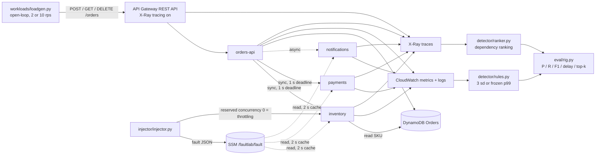

# serverless-fault-localisation

Rule-based fault detection (CloudWatch) and localisation (X-Ray) for a small
AWS serverless order-processing app, compared with learned root-cause
baselines. It is the artefact for the MSc research project; the master prompt in
the folder above has the full brief.

The question behind it: how close do plain CloudWatch rules plus an X-Ray
dependency ranking get to learned root-cause methods, and what do they cost in
telemetry? Three legs answer it, because the two kinds of method cannot run on
the same inputs (docs/ANALYSIS_PLAN.md):

1. **Ceiling** - Xing et al. (2025), quoted only, never as a same-rig competitor.
2. **Like-for-like** - the rule arm and RCAEval baselines on the same public benchmark cases (offline).
3. **Overhead** - telemetry volume, latency with tracing on / off and cost on the live AWS rig.

## Where things stand

| part | state |
|---|---|
| SAM stack: REST API, 4 functions, shared layer, DynamoDB, SSM fault switch, X-Ray sampling rule, log retention, budget | done - cfn-lint clean, handlers tested locally |
| fault injector + schedule (4 fault types, ground-truth log) | done - tested on moto |
| detector: CloudWatch rules (frozen, hashed) + X-Ray ranker | done - unit tested |
| eval: P / R / F1 / delay / top-k, statistics, overhead | done - tested |
| leg 2 on RCAEval RE2-OB (90 cases) | run offline on public data -> `results/rcaeval/` |
| rig pipeline end to end | checked on **simulated** telemetry only -> `results/sim/` (NOT AWS data) |
| live calibration, campaigns, overhead | **not run yet** - needs your own AWS account, see docs/CONFIGURATION_MANUAL.md |
| report, weekly logs, ethics form, viva | yours - checklists in `report/`, `weekly/`, `docs/ETHICS.md`, `docs/DEMO.md` |

## Architecture



Any of inventory, payments or notifications can be the injected target
(throttling is shown on inventory only to keep the picture readable).

## Folder layout

```text
serverless-fault-localisation/
├── template.yaml        # SAM: REST API, 4 functions, layer, DynamoDB, SSM fault switch, sampling rule, budget
├── src/                 # handlers + shared layer (fault switch, X-Ray patching, logging, downstream calls)
├── injector/            # schedule builder + injector (writes the ground truth)
├── workloads/           # open-loop load generator
├── detector/            # CloudWatch rules, X-Ray ranker, span flattening, collectors
├── eval/                # rig evaluation, leg 2 analysis, overhead, statistics
├── baseline_runner/     # RCAEval download, the rule arm on RCAEval, baseline wrapper
├── sim/                 # telemetry simulator for the functional check (made-up numbers)
├── configs/             # versions, experiment (frozen before calibration), dated prices
├── scripts/             # campaign runner, collectors, budget estimate, seeding, citation check
├── results/ figures/    # outputs - every summary says where its data came from
├── bib/                 # verified references only
├── docs/                # configuration manual, analysis plan, taxonomy, assumptions, ethics, demo
├── report/ weekly/      # checklist and template only
└── tests/
```

## Quick start (no AWS, nothing costs money)

```bash
make setup                          # .venv with requirements-dev.txt (Python 3.12)
make test lint cfn-lint check-bib
