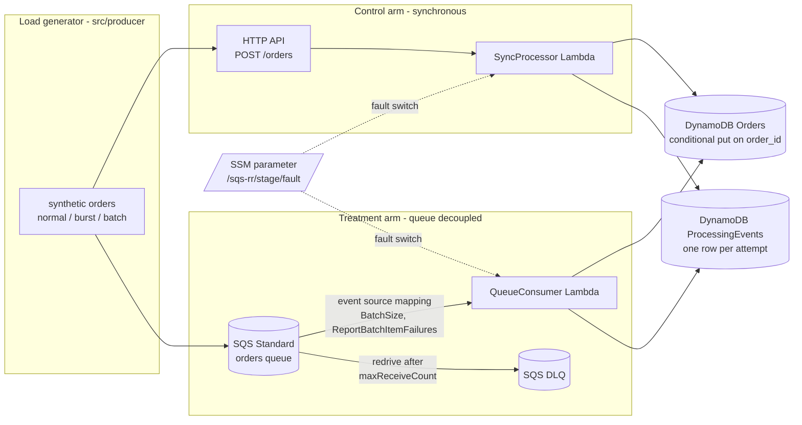
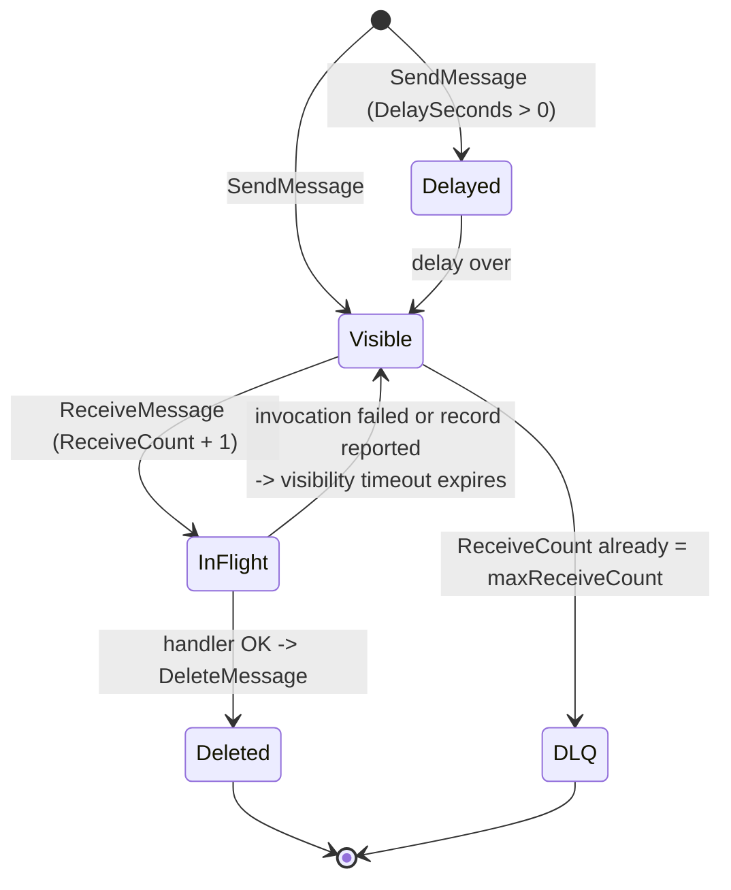
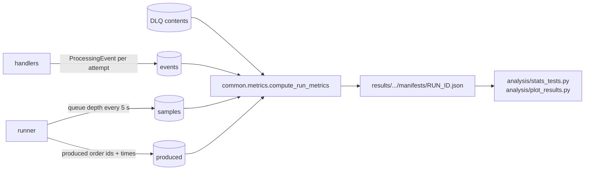

# Architecture and design notes

Project: *Reliability and Recovery of Amazon SQS Messaging under Injected
Consumer and Downstream Failures* - Anjaneya Reddy Gurram (24288853), MSc Cloud
Computing, NCI.

## 1. The two arms

Both functions run exactly the same processing code
(`src/common/processing.py`). The only difference is who waits: in the sync
arm the client waits for the answer and has to retry itself; in the queue arm
SQS holds the message and redelivers it.

## 2. Life of one message in the queue arm

This is why the three parameters matter only under failure:

* **visibility timeout** decides how long a failed message waits before it is
  tried again (so it drives recovery time),
* **maxReceiveCount** decides how many tries a message gets before it is moved
  to the DLQ (so it trades DLQ capture against retries / duplicates),
* **batch size** decides how many messages share the fate of one failed
  invocation (blast radius, duplicates).

In a healthy system every message goes Visible -> InFlight -> Deleted on the
first try and none of the three settings ever does anything.

## 3. Fault model (`src/common/faults.py`)

| Mode | Injection point | What Lambda/SQS sees | What gets retried |
|------|-----------------|----------------------|-------------------|
| `none` | - | normal processing | nothing (only at-least-once duplicates) |
| `consumer_kill` | before a record is processed | process exits (`os._exit(1)`) | whole batch after VT |
| `unhandled_error` | before or after the write | exception escapes the handler | whole batch after VT; records written before the crash come back as duplicates |
| `datastore_reject` | before the write | write refused -> `batchItemFailures` | only that record after VT |
| `datastore_timeout` | before the write | write hangs past the function timeout | whole batch after VT, poller blocked for the full timeout |

`FAULT_RATE` is a probability per record at the injection point, active only
inside the fault window. The window is written to the SSM parameter as absolute
times at the start of a run, so the functions switch themselves on and off.

## 4. Evidence and metrics

Idempotency: the Orders write is a conditional put on `order_id`. A
redelivered message finds the order already there and is logged as
`duplicate_success` (a harmless transport duplicate). With `IDEMPOTENCY=off`
the write is blind and a redelivery is logged as `unsafe_double_apply`.

Recovery time is measured on the **backlog** (visible + in flight + delayed),
not only on `ApproximateNumberOfMessagesVisible`. Failed messages are
*invisible* until their visibility timeout expires, so the visible count can
look perfectly healthy while hundreds of messages are waiting. The visible-only
version is still computed (`recovery_time_visible_s`) as a sensitivity check;
`results/figures/timeline_visible_vs_backlog.png` shows the difference.

## 5. Local simulator vs live AWS

| | DRY_RUN=1 (`src/localsim`) | DRY_RUN=0 + `--live` |
|---|---|---|
| handler code | the real `handle_batch` / `handle_request` | the same code deployed by SAM |
| SQS | in-memory queue: VT, receive count, redrive, stale receipt handles, delay, rare duplicate copies | real SQS Standard |
| event source mapping | N pollers, batch size, 1 s batching window, long polling, error back-off | real Lambda ESM |
| DynamoDB | dict with conditional put | real tables |
| time | virtual clock (a 20 minute run takes milliseconds) | wall clock |
| timing numbers | assumptions in the `sim:` block (cold start, write latency ...) | measured |

The simulator exists so the whole pipeline (configs, runner, metrics,
statistics, figures) can be built and checked for free, and so the pilot can
be planned. Its numbers depend on its timing assumptions and on the SQS
behaviour it models, so they are **not** AWS measurements; every manifest
records `backend: localsim` and every figure title says "(local simulation)".

## 6. Design decisions (short)

* **AWS SAM** - Lambda + SQS + DynamoDB + event source mapping are one template;
  `sam delete` makes teardown one command.
* **SQS Standard, not FIFO** - Standard is the default most systems use and the
  baseline paper studied; FIFO changes ordering/deduplication semantics and is
  future work.
* **In-process faults, no AWS FIS** - cheaper, simpler, and lets the fault fire
  at a precise point in the processing path.
* **SSM parameter as the switch** - flip faults without redeploying; env vars
  are the fallback.
* **Deterministic run ids and seeds** - rerunning a config reproduces the same
  runs; randomised run order spreads provider drift across cells.
* **Manifests as the single source of truth** - the analysis never reads
  hand-edited files.

Anjaneya Reddy Gurram
