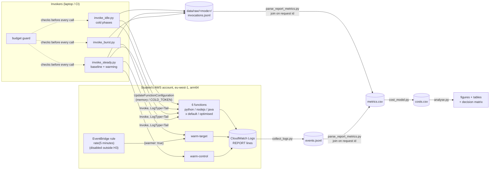
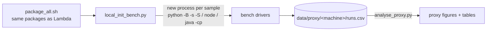

# Architecture

Kondragunta Lakshmi Chaitanya - 25171216

## Measurement path

`DATA_MODE=mock` swaps the whole AWS box for `src/coldstart/mock.py`: same
interface, virtual clock, synthetic REPORT lines and synthetic log events. The
rest of the pipeline is identical, which is why it can be tested without an
account.

## Why each piece is there

* **Cold = Init Duration present.** The invoker only *tries* to get a cold start
  (configuration update or idle wait). Whether it was cold is read from the
  REPORT line, and misses are counted (`discarded_intended_colds.csv`).
* **Two REPORT sources.** The invoke log tail gives the REPORT line immediately;
  CloudWatch Logs is the authoritative copy and also has the warmer pings, which
  the client never sees but which cost money.
* **Warming pair.** `warm-target` and `warm-control` run the same code with the
  same memory; only the target has the EventBridge rule. Both get the same
  Poisson arrivals at the same moments, so the 20-minute blocks pair the arms.
* **Interleaved randomised blocks.** Every block runs each cell once in a new
  random order, so slow periods of the day hit all cells.
* **Budget guard** before every call; spend log after every call.

## Local init-proxy path

A real measurement of loading each runtime and package from a cold process on
one machine. It has no micro-VM start, no code download and no Lambda runtime
API, so it is only used as supporting evidence about *relative* package and
runtime load cost.

## Code map

| module | job |
|---|---|
| `report_parser.py` | REPORT line -> fields, cold flag |
| `config.py` | experiment / pilot config, validation, cells |
| `backends.py` | `LiveBackend` (boto3) and `MockBackend` |
| `mock.py` | environment pools, idle lifetime, warmer pings, synthetic logs |
| `driver.py` | phase runners (cold, warm, warming, burst, idle probe), recorder |
| `budget.py` | daily cap + spend log |
| `logs.py`, `metrics.py` | CloudWatch pull, request-id join, warm-discards |
| `cost_model.py` | billed time incl. INIT billing rule, USD per 1k |
| `stats.py` | Shapiro gate, t / MWU / ANOVA / KW / paired, effect sizes, Holm, Wilson, Fisher |
| `analysis.py` | hypotheses, decision matrix, figures, tables |
| `power.py` | pilot -> n per cell, idle-gap probe |
| `packaging.py`, `localbench.py`, `proxy_analysis.py` | packages + manifest, init proxy benchmark |
