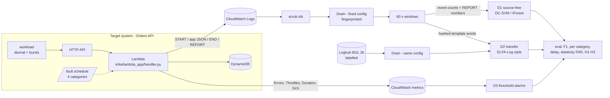

# Architecture and design notes

Project: *Source-Free Log Anomaly Detection for AWS Serverless Applications:
Measuring the Accuracy Forfeited When No Labelled Source Exists* -
Kasireddy Vadicharla (25104047), MSc Cloud Computing, NCI.

## 1. Pipeline

In the default mode the target system is the **local Lambda runtime
emulator** (`src/logad/collect/runtime.py`): it imports the real handler file,
runs it against a fake DynamoDB table that raises the real botocore errors, and
writes exactly the lines Lambda writes to CloudWatch (START / app JSON / END /
REPORT, `Task timed out`, `Runtime exited with error`). Execution environments
are modelled (cold starts with Init Duration, idle reclaim, recycling,
reserved concurrency / throttles). The live path (LocalStack or own account)
produces the same file format, so everything after collection is identical.

## 2. Phases

```mermaid
gantt
  dateFormat  X
  axisFormat %H h
  section seed
  A - clean training (24 h, natural bursts)            :a, 0, 24
  B - 240 injections in 20 blocks (~48 h)              :b, after a, 48
  C - fault-free elasticity control (6 h, big bursts)  :c, after b, 6
```

* **A** has no injections at all. Before training, the pipeline certifies it
  clean (no injection overlaps it, no fault signature lines, no 5xx) and
  refuses to train otherwise (Albert, 2024).
* **B** = normal traffic + 60 injections per category, 3 of each category per
  block of 12 (blocks are the pairing unit for the statistics).
* **C** = no faults, bursts 40x the base rate: every alarm here is a false
  alarm caused by benign elasticity (Nguyen et al., 2025).
* Training always ends before evaluation starts (chronological split,
  Le and Zhang, 2022) - asserted in `pipeline.py`.

## 3. Fault categories (Xie et al., 2025) and what they look like in the logs

| Category | Injected as | Log signature |
|----------|-------------|---------------|
| permission_denied | deny `dynamodb:PutItem` on the role | `[ERROR]` JSON, `AccessDeniedException ... not authorized to perform: dynamodb:PutItem` (writes only) |
| config_error | `TABLE_NAME` points nowhere | `[ERROR]` JSON, `ResourceNotFoundException` on every table call |
| dependency_timeout | slow DynamoDB | long `downstream_ms`, `DownstreamTimeout` 504s, `Task timed out after 3.00 seconds` |
| resource_exhaustion | memory 128 MB | `Memory Size: 128 MB`, `Max Memory Used: 128 MB`, `Runtime exited with error: signal: killed`, slower |

## 4. Detectors

| | D1 source-free | D2 transfer (baseline) | D3 alarms |
|---|---|---|---|
| training data | phase A of the app only, no labels | labelled Loghub BGL + unlabelled phase A | phase A metrics (calibration only) |
| features | event count vector over phase A templates + never-seen-template column + REPORT numbers | hashed words of the templates (shared vocabulary across systems), TF-IDF, SVD | CloudWatch metrics per minute |
| model | OC-SVM (primary) and Isolation Forest | CORAL alignment + logistic regression + entropy-based pseudo-labelling (3 rounds) | Errors, 5XX, Duration p99, Throttles > threshold |
| threshold | 99th percentile of own training scores | p >= 0.5 | max(p99 of phase A, floor) |

D2 is an *operational* re-implementation of the two ideas of ELFA-Log
(Zhao et al., 2025): high-confidence pseudo-labels selected by entropy and a
distance-based feature alignment. Simplifications: linear model instead of a
neural encoder, hashed bag-of-words instead of pretrained embeddings, CORAL
instead of the paper's exact alignment loss.

## 5. Design decisions (short)

* **Parser fixed and fingerprinted** - Khan et al. (2024): parser accuracy does
  not predict detection accuracy, so it is never tuned; the same config parses
  both corpora; a changed config stops the pipeline.
* **Online parsing in time order** - the template stored for a line is the one
  Drain had when the line arrived, so later logs never leak into earlier windows.
* **Windows of 60 s** - the CloudWatch metric period, so D3 and the log
  detectors judge exactly the same time slices.
* **D1 primary = OC-SVM** - fixed after the pilot, before the main run. The
  first rule (lowest validation false-alarm rate) chose Isolation Forest,
  which is almost blind here: it cannot split on a feature that was constant
  in clean training (e.g. the never-seen-template column). Documented in
  `configs/detectors.yaml`; both models are still reported.
* **D3 on metrics, not logs** - that is how operators actually alarm, and it
  keeps D3 independent of the parser.
* **Identifier scrubbing before anything is stored for analysis** - request
  ids, account ids, IPs, order ids.

Kasireddy Vadicharla
