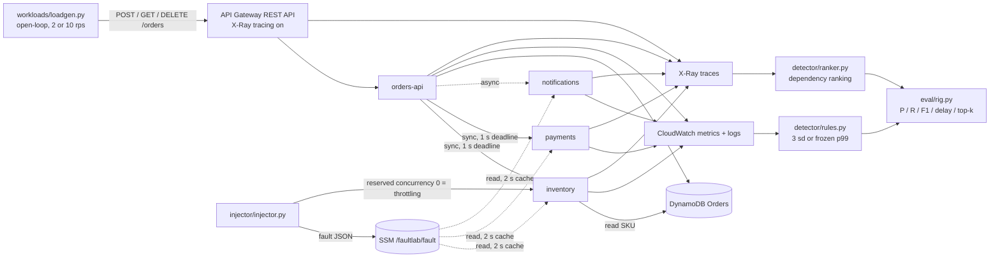

# serverless-fault-localisation

Rule-based fault detection (CloudWatch) and localisation (X-Ray) for a small
AWS serverless order-processing app, compared with learned root-cause
baselines. It is the artefact for the MSc research project; the master prompt in
the folder above has the full brief.

The question behind it: how close do plain CloudWatch rules plus an X-Ray
dependency ranking get to learned root-cause methods, and what do they cost in
telemetry? Three legs answer it, because the two kinds of method cannot run on
the same inputs (docs/ANALYSIS_PLAN.md):

1. **Ceiling** - Xing et al. (2025), quoted only, never as a same-rig competitor.
2. **Like-for-like** - the rule arm and RCAEval baselines on the same public benchmark cases (offline).
3. **Overhead** - telemetry volume, latency with tracing on / off and cost on the live AWS rig.

## Where things stand

| part | state |
|---|---|
| SAM stack: REST API, 4 functions, shared layer, DynamoDB, SSM fault switch, X-Ray sampling rule, log retention, budget | done - cfn-lint clean, handlers tested locally |
| fault injector + schedule (4 fault types, ground-truth log) | done - tested on moto |
| detector: CloudWatch rules (frozen, hashed) + X-Ray ranker | done - unit tested |
| eval: P / R / F1 / delay / top-k, statistics, overhead | done - tested |
| leg 2 on RCAEval RE2-OB (90 cases) | run offline on public data -> `results/rcaeval/` |
| rig pipeline end to end | checked on **simulated** telemetry only -> `results/sim/` (NOT AWS data) |
| live calibration, campaigns, overhead | **not run yet** - needs your own AWS account, see docs/CONFIGURATION_MANUAL.md |
| report, weekly logs, ethics form, viva | yours - checklists in `report/`, `weekly/`, `docs/ETHICS.md`, `docs/DEMO.md` |

## Architecture



Any of inventory, payments or notifications can be the injected target
(throttling is shown on inventory only to keep the picture readable).

## Folder layout

```text
serverless-fault-localisation/
├── template.yaml        # SAM: REST API, 4 functions, layer, DynamoDB, SSM fault switch, sampling rule, budget
├── src/                 # handlers + shared layer (fault switch, X-Ray patching, logging, downstream calls)
├── injector/            # schedule builder + injector (writes the ground truth)
├── workloads/           # open-loop load generator
├── detector/            # CloudWatch rules, X-Ray ranker, span flattening, collectors
├── eval/                # rig evaluation, leg 2 analysis, overhead, statistics
├── baseline_runner/     # RCAEval download, the rule arm on RCAEval, baseline wrapper
├── sim/                 # telemetry simulator for the functional check (made-up numbers)
├── configs/             # versions, experiment (frozen before calibration), dated prices
├── scripts/             # campaign runner, collectors, budget estimate, seeding, citation check
├── results/ figures/    # outputs - every summary says where its data came from
├── bib/                 # verified references only
├── docs/                # configuration manual, analysis plan, taxonomy, assumptions, ethics, demo
├── report/ weekly/      # checklist and template only
└── tests/
```

## Quick start (no AWS, nothing costs money)

```bash
make setup                          # .venv with requirements-dev.txt (Python 3.12)
make test lint cfn-lint check-bib
make sim                            # rig pipeline on simulated telemetry -> results/sim (NOT AWS data)
make budget                         # cost estimate of the whole live experiment
```

## Leg 2 - RCAEval (offline, public data)

```bash
make rcaeval-data                   # RE2-OB from the Hugging Face copy, ~0.9 GB, into data/rcaeval
make rcaeval-venv                   # separate .venv-rcaeval with RCAEval 1.7.0 (old pinned deps)
make leg2                           # rule arm + baselines + analysis -> results/rcaeval, figures/rcaeval
```

The baseline subset was narrowed early (master prompt section 6), keeping one
trace-based method from the TraceRCA line and one deep learned method:

| method | kind | cases |
|---|---|---|
| BARO | metric, Bayesian change point | 90 |
| CIRCA | metric, causal graph + regression | 90 |
| TraceRCA | traces (TraceRCA-style lineage) | 90 |
| CausalRCA | deep (DAG-GNN + PageRank) | 30 (repetition 1), minutes per case |

Every method gets the same 600 s either side of the injection, and the entry
service's latency as the SLI (RCAEval's main.py passes the root cause's own
latency, which gives the answer away). The rule arm is adapted to 10 s buckets
and the 600 s of history the benchmark has; see docs/ANALYSIS_PLAN.md.

## Live AWS (short version)

Full steps, IAM sketch and troubleshooting: docs/CONFIGURATION_MANUAL.md.

```bash
make deploy                                         # sam build + sam deploy
python scripts/seed_inventory.py --table <TableName output>
make calibration API_URL=<ApiUrl output>            # 24 h fault-free, then thresholds are frozen
make steady API_URL=<ApiUrl output>                 # 60 min control + 240 injections
make peak API_URL=<ApiUrl output>                   # the same at 5x the load
make collect                                        # CloudWatch series + X-Ray spans (within 15 days)
make rig                                            # results/live
make destroy                                        # sam delete - do not forget
```

Overhead runs (full / policy / off) need a redeploy per condition; the
parameters are in the configuration manual.

## How detection and ranking work

- **Detection.** Per function, one series each for ErrorRate, ThrottleRate and
  average Duration per minute. A series fires when it moves more than 3 sd away
  from its 30-minute rolling mean, or crosses the p99 of the 24 h fault-free
  calibration, whichever comes first. Thresholds are computed once, hashed
  (SHA-256) and refused if edited later.
- **Ranking.** Over the traces up to the detection time:
  `score(s) = share of failed traces implicating s + 0.5 x (mean depth of those spans / deepest span)`.
  A service is implicated where a fault starts (fault flag, no faulting child)
  or where its own work takes longer than its calibration p99. Full definition
  in the docstring of detector/ranker.py.

## Twelve-week plan

| weeks | focus |
|---:|---|
| 1-4 | deploy the instrumented app + injector; freeze the fault taxonomy (docs/FAULT_TAXONOMY.md) |
| 4 | 24 h calibration; freeze configs |
| 4-8 | rule-arm campaigns on the rig; RCAEval baselines in parallel (already run once here) |
| 8-9 | overhead: tracing full / policy / off |
| 9-11 | statistics + write-up |
| 12 | contingency; polish configuration manual and demo |

## Changes from the brief (and why)

- **REST API, not HTTP API.** X-Ray cannot trace HTTP APIs, and the brief asks for tracing on API Gateway.
- **Throttling = reserved concurrency 0** on the target for 60 s. Driving DynamoDB past its limit is unsafe and slow on on-demand tables.
- **Entry-service SLI** for the RCAEval methods, not main.py's root-cause SLI (see above).
- **CausalRCA on 30 cases** because of its run time.
- **Detection F1 against the baselines** cannot be computed as the brief words it: RCAEval's methods only localise. docs/ANALYSIS_PLAN.md ("Open decision") lists the options - settle it with your supervisor.
- The Xing et al. (2025) figures are taken from the master prompt; the MDPI page could not be opened from here, so check them against the PDF yourself.

## Reading the results

- `results/rcaeval/` - real runs on **public benchmark data** (RCAEval, MIT licence), not AWS.
- `results/sim/` - simulated telemetry, only shows the pipeline works. Never report these numbers.
- `results/live/` - appears after the live campaign. Only this folder says anything about AWS.

Yashaswini Penumarthi (24262404)
